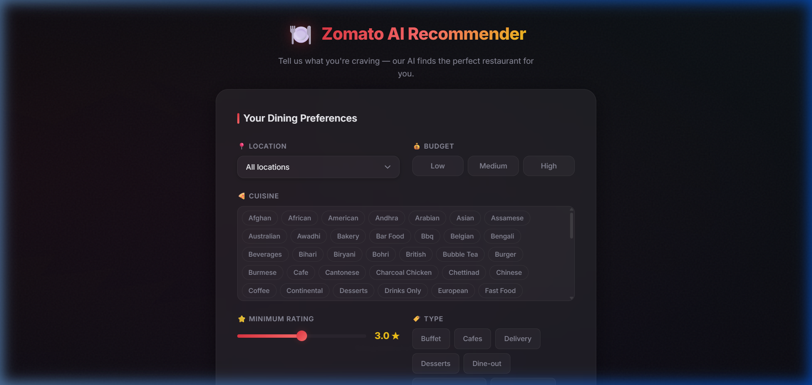
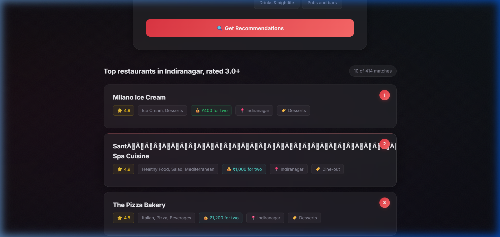

# Zomato AI Restaurant Recommender




An intelligent, vibe-based restaurant discovery tool built with Vanilla JS, Flask, and Google Gemini LLM. It helps you find the perfect restaurant in Bangalore based on your budget, preferred cuisines, and vibe, rather than just raw keyword search.

## Features
- **Fast Filtering**: In-memory pandas filtering of ~10k restaurants for sub-millisecond querying.
- **AI-Powered Explanations**: Uses Google Gemini to rank the top results and generate a human-like explanation of *why* the restaurant is a good fit for you.
- **Graceful Fallbacks**: Fully functional even if the LLM API is unavailable or rate-limited.
- **Modern UI**: Dark-themed, glassmorphic UI with dynamic layout and stagger animations.

## Tech Stack
- **Frontend**: Vanilla HTML/CSS/JS (Zero dependencies, incredibly fast).
- **Backend**: Python, Flask, Pandas.
- **AI**: Google Gemini (`google-genai` SDK).

## How to Run Locally

### 1. Backend Setup

First, make sure you have Python 3.9+ installed.

```bash
# Navigate to the backend directory
cd backend

# Install dependencies
pip install -r requirements.txt

# (Optional) Set your Gemini API key for AI explanations
# If you don't set this, the app will run in fallback mode without AI explanations
# Windows PowerShell:
$env:GEMINI_API_KEY="your_api_key_here"
# Mac/Linux:
export GEMINI_API_KEY="your_api_key_here"

# Start the Flask API
python app.py
```
The backend API will start at `http://127.0.0.1:5000`.

### 2. Frontend Setup

Since the frontend is just static files, you can use any HTTP server to serve them.

```bash
# In a new terminal, navigate to the frontend directory
cd frontend

# Start a simple Python HTTP server
python -m http.server 8080
```
Open your browser and navigate to `http://localhost:8080/`.

## Deployment

### Frontend (Static Hosting)
You can deploy the `frontend/` folder directly to **Vercel**, **Netlify**, or **GitHub Pages**. Since it's purely static files (`index.html`, `style.css`, `app.js`), no build step is required.
*Note: You will need to update `API_BASE` in `app.js` to point to your live backend URL.*

### Backend (Python Service)
You can deploy the `backend/` folder to **Render**, **Railway**, or **Heroku**. 
1. Make sure to set the `GEMINI_API_KEY` environment variable in your host's dashboard.
2. Tell your host to start the server using Gunicorn: `gunicorn -w 4 -b 0.0.0.0:$PORT app:app` (You may need to add `gunicorn` to `requirements.txt`).
