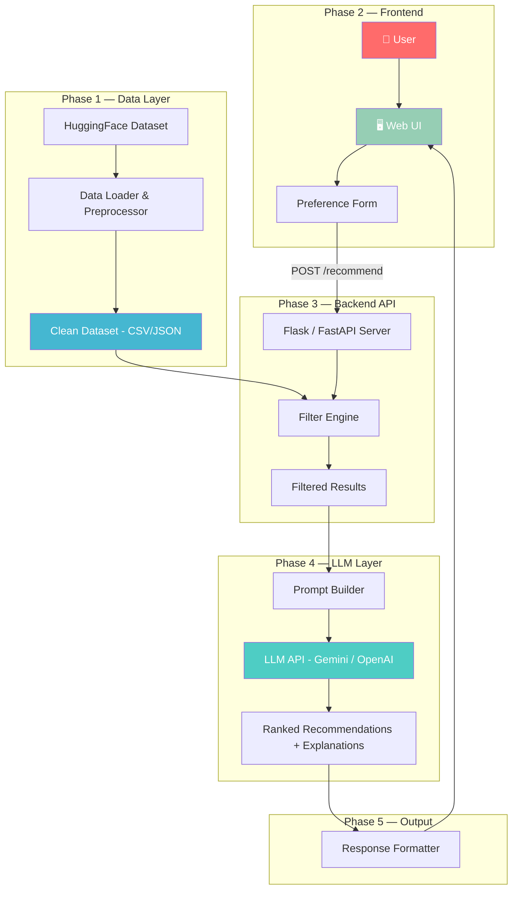
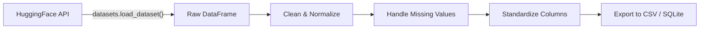
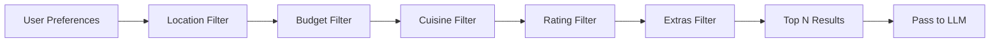
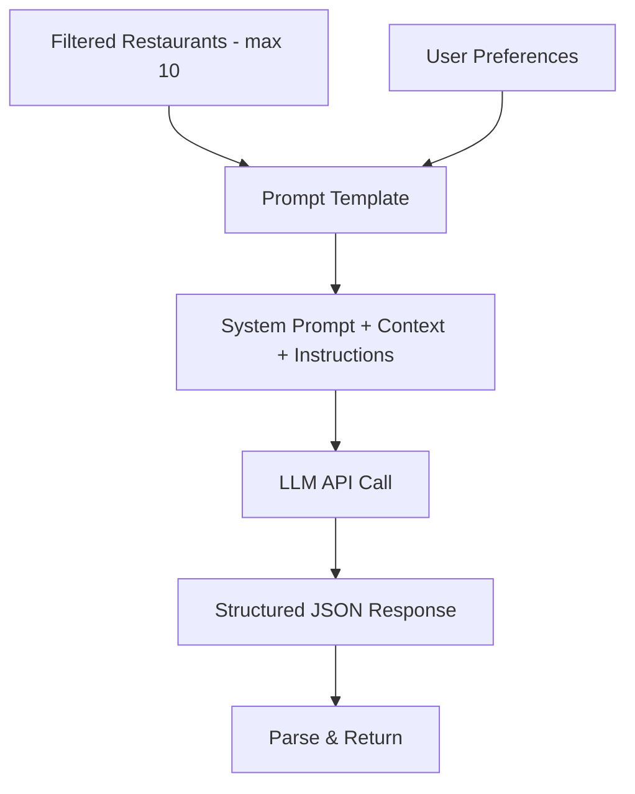

# 🏗️ Phase-Wise Architecture

> Architecture blueprint for the **AI-Powered Restaurant Recommendation System**
> Refer to [problemstatement.md](./problemstatement.md) for full project context.

---

## 📋 Phase Overview

| Phase | Name | Focus | Deliverable |
|-------|------|-------|-------------|
| **1** | Data Foundation | Dataset ingestion & storage | Clean, queryable restaurant data |
| **2** | User Interface | Frontend for preference collection | Interactive web UI |
| **3** | Filter & Query Engine | Backend filtering logic | REST API that returns filtered restaurants |
| **4** | LLM Integration | Prompt engineering & LLM calls | AI-powered ranking and explanations |
| **5** | Polish & Deploy | End-to-end integration, UX polish | Production-ready application |

---

## 🔗 System Architecture Diagram



---

## 🔶 Phase 1 — Data Foundation

**Goal:** Load, clean, and store the Zomato dataset so it can be efficiently queried.

### Data Pipeline



### Key Tasks

| # | Task | Detail |
|---|------|--------|
| 1 | **Fetch dataset** | Use `datasets` library to pull [ManikaSaini/zomato-restaurant-recommendation](https://huggingface.co/datasets/ManikaSaini/zomato-restaurant-recommendation) |
| 2 | **Explore schema** | Identify all columns, data types, null rates |
| 3 | **Clean data** | Drop duplicates, handle nulls, normalize text (lowercase city names, trim whitespace) |
| 4 | **Standardize budget** | Map raw cost values into `Low / Medium / High` buckets |
| 5 | **Persist** | Save cleaned data as `data/restaurants_clean.csv` for fast local reads |

### Schema (Target)

```
restaurants_clean.csv
├── name          : str    — Restaurant name
├── city          : str    — City / locality
├── cuisines      : str    — Comma-separated cuisine types
├── cost_for_two  : float  — Average cost for two people
├── budget        : str    — Low | Medium | High (derived)
├── rating        : float  — Aggregate rating (0–5)
├── votes         : int    — Number of user votes
└── highlights    : str    — Tags like "Family Friendly", "Outdoor Seating"
```

### Tech Stack

| Component | Choice | Why |
|-----------|--------|-----|
| Data loading | `datasets` (HuggingFace) | Native integration with HF hub |
| Processing | `pandas` | Industry standard for tabular data |
| Storage | CSV / SQLite | Simple, no infra overhead |

---

## 🟢 Phase 2 — User Interface

**Goal:** Build a clean, modern web UI where users input their dining preferences.

### UI Layout

```
┌─────────────────────────────────────────────────┐
│  🍽️  Zomato AI Restaurant Recommender           │
├─────────────────────────────────────────────────┤
│                                                 │
│  📍 Location     [ Dropdown / Autocomplete  ]   │
│  💰 Budget       [ Low | Medium | High      ]   │
│  🍕 Cuisine      [ Multi-select chips       ]   │
│  ⭐ Min Rating   [ Slider: 1.0 ——●—— 5.0   ]   │
│  🏷️ Extras       [ Checkboxes              ]   │
│                                                 │
│          [ 🔍 Get Recommendations ]             │
│                                                 │
├─────────────────────────────────────────────────┤
│                                                 │
│  📋 Results Area                                │
│  ┌───────────────────────────────────────────┐  │
│  │ 🏪 Restaurant Name        ⭐ 4.5         │  │
│  │ 🍽️ Italian, Continental   💰 ₹800/two    │  │
│  │ 🤖 "Perfect for a family dinner because…"│  │
│  └───────────────────────────────────────────┘  │
│                                                 │
└─────────────────────────────────────────────────┘
```

### Tech Stack

| Component | Choice | Why |
|-----------|--------|-----|
| Structure | HTML5 | Semantic, accessible |
| Styling | Vanilla CSS | Full control, no dependency bloat |
| Logic | Vanilla JavaScript | Lightweight, no build step needed |
| Design | Dark theme + glassmorphism | Modern, premium feel |

### Key UI Features

- **Animated card reveals** — recommendations slide in with stagger animation
- **Loading skeleton** — shimmer effect while LLM generates response
- **Responsive layout** — works on mobile and desktop
- **Micro-interactions** — hover effects on cards, animated submit button

---

## 🔵 Phase 3 — Filter & Query Engine (Backend)

**Goal:** Build a backend API that filters restaurants based on user preferences and prepares data for the LLM.

### API Design

```
POST /api/recommend
```

**Request Body:**
```json
{
  "location": "Delhi",
  "budget": "Medium",
  "cuisines": ["Italian", "Continental"],
  "min_rating": 4.0,
  "extras": ["Family Friendly"]
}
```

**Response Body:**
```json
{
  "recommendations": [
    {
      "name": "Olive Bar & Kitchen",
      "city": "Delhi",
      "cuisines": "Italian, Continental",
      "rating": 4.6,
      "cost_for_two": 2500,
      "budget": "High",
      "explanation": "A refined Italian dining experience..."
    }
  ],
  "query_summary": "Top Italian restaurants in Delhi, rated 4.0+",
  "total_matches": 12
}
```

### Filter Pipeline



### Tech Stack

| Component | Choice | Why |
|-----------|--------|-----|
| Framework | Python + Flask | Simple, widely known, fast to build |
| Data layer | `pandas` | Filter operations on DataFrame |
| API format | JSON | Universal, frontend-friendly |
| CORS | `flask-cors` | Enable cross-origin requests from frontend |

### Key Logic

```python
def filter_restaurants(df, preferences):
    filtered = df.copy()

    if preferences.get("location"):
        filtered = filtered[filtered["city"].str.contains(preferences["location"], case=False)]

    if preferences.get("budget"):
        filtered = filtered[filtered["budget"] == preferences["budget"]]

    if preferences.get("cuisines"):
        pattern = "|".join(preferences["cuisines"])
        filtered = filtered[filtered["cuisines"].str.contains(pattern, case=False)]

    if preferences.get("min_rating"):
        filtered = filtered[filtered["rating"] >= preferences["min_rating"]]

    return filtered.head(10)  # Top 10 for LLM context
```

---

## 🟣 Phase 4 — LLM Integration

**Goal:** Use a Large Language Model to rank filtered restaurants and generate human-like explanations.

### Prompt Architecture



### Prompt Template (Example)

```
SYSTEM:
You are a knowledgeable food critic and restaurant advisor.
Given a list of restaurants and the user's preferences, rank them
from best to worst fit. For each, provide a 2-3 sentence explanation
of why it's a good match.

Respond in valid JSON format:
[
  {
    "name": "...",
    "rank": 1,
    "explanation": "...",
    "match_score": 95
  }
]

USER PREFERENCES:
- Location: {location}
- Budget: {budget}
- Cuisine: {cuisines}
- Minimum Rating: {min_rating}
- Extras: {extras}

RESTAURANTS:
{restaurant_data_table}
```

### LLM Options

| Provider | Model | Pros | Cons |
|----------|-------|------|------|
| **Google Gemini** | `gemini-pro` | Free tier, strong reasoning | Rate limits on free tier |
| **OpenAI** | `gpt-4o-mini` | Excellent JSON output | Paid API |
| **Groq** | `llama-3` | Very fast inference | Smaller context window |

### Error Handling

| Scenario | Handling |
|----------|----------|
| LLM returns invalid JSON | Retry with stricter prompt; fallback to raw text display |
| API timeout | Return filtered results without AI explanation |
| No restaurants match filters | Return "No matches" message with relaxed filter suggestions |
| Rate limit exceeded | Queue request with retry-after delay |

---

## 🟡 Phase 5 — Polish & Deploy

**Goal:** Wire everything together, polish the UX, and prepare for deployment.

### Integration Checklist

| # | Task | Status |
|---|------|--------|
| 1 | Connect frontend form → backend API | ⬜ |
| 2 | Display LLM recommendations in result cards | ⬜ |
| 3 | Add loading states and error handling in UI | ⬜ |
| 4 | Test end-to-end with various preference combos | ⬜ |
| 5 | Add "No results" and edge-case UI states | ⬜ |
| 6 | Performance optimization (caching, lazy load) | ⬜ |
| 7 | Mobile responsiveness testing | ⬜ |
| 8 | Deploy frontend + backend | ⬜ |

### Deployment Options

| Option | Frontend | Backend | Best For |
|--------|----------|---------|----------|
| **Local** | `Live Server` | `flask run` | Development |
| **Vercel + Render** | Vercel (static) | Render (Flask) | Free hosting |
| **Railway** | Railway | Railway | Single-platform deploy |

---

## 📁 Proposed Folder Structure

```
zomato-recommendation/
├── docs/
│   ├── problemstatement.md
│   └── architecture.md          ← You are here
├── data/
│   ├── raw/                     ← Raw dataset from HuggingFace
│   └── restaurants_clean.csv    ← Processed dataset
├── backend/
│   ├── app.py                   ← Flask server + API routes
│   ├── filter_engine.py         ← Restaurant filtering logic
│   ├── llm_service.py           ← LLM prompt building + API calls
│   ├── data_loader.py           ← Dataset loading + preprocessing
│   └── requirements.txt         ← Python dependencies
├── frontend/
│   ├── index.html               ← Main page
│   ├── style.css                ← Styling (dark theme, animations)
│   └── app.js                   ← Frontend logic + API calls
└── README.md
```

---

## 🔑 Key Design Decisions

| Decision | Choice | Rationale |
|----------|--------|-----------|
| No database | CSV / in-memory DataFrame | Dataset is small (~10K rows); no need for DB overhead |
| No frontend framework | Vanilla HTML/CSS/JS | Keeps it simple; no build step; fast to iterate |
| Flask over FastAPI | Flask | Simpler for this scope; team familiarity |
| LLM for ranking, not filtering | Hybrid approach | Filtering is deterministic (faster, cheaper); LLM adds reasoning on top |
| JSON API contract | Structured request/response | Clean separation of frontend and backend |
