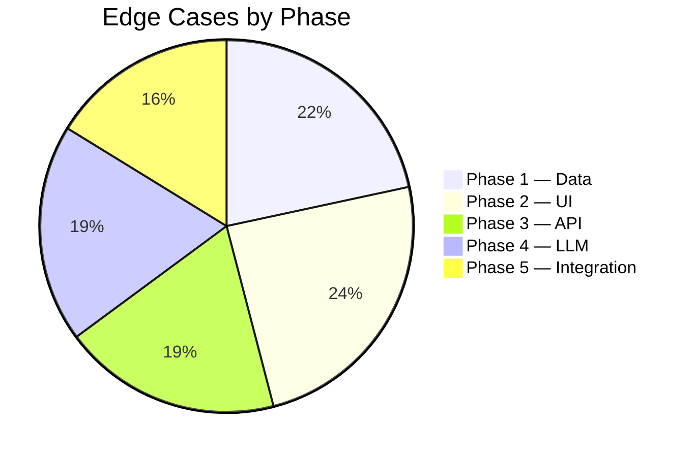

# 🛡️ Edge Cases & Error Handling Matrix

> Comprehensive edge case coverage for the **AI-Powered Restaurant Recommendation System**
> Derived from [problemstatement.md](./problemstatement.md) and [architecture.md](./architecture.md)

---

## Severity Legend

| Icon | Level | Meaning |
|------|-------|---------|
| 🔴 | **Critical** | App crashes or returns completely wrong results — must handle before launch |
| 🟠 | **High** | Degraded experience or silent failures — should handle before launch |
| 🟡 | **Medium** | Uncommon scenario, but poor UX if unhandled |
| 🟢 | **Low** | Cosmetic or rare — nice to handle, not blocking |

---

## Phase 1 — Data Foundation

### 1.1 Dataset Loading

| # | Edge Case | Severity | Expected Behavior | Test Scenario |
|---|-----------|----------|-------------------|---------------|
| 1.1.1 | HuggingFace API is down or unreachable | 🔴 | Fall back to locally cached `restaurants_clean.csv`; log warning | Disconnect network → run `data_loader.py` |
| 1.1.2 | Dataset schema changes (columns renamed/removed) | 🔴 | Validate schema on load; abort with clear error listing missing columns | Rename a column in raw data → re-run loader |
| 1.1.3 | Dataset is empty (0 rows) | 🔴 | Raise `DatasetEmptyError`; do not create empty CSV | Replace dataset with empty DataFrame → load |
| 1.1.4 | Dataset download is interrupted mid-stream | 🟠 | Retry up to 3 times with exponential backoff; fail gracefully | Simulate timeout during `load_dataset()` |
| 1.1.5 | Extremely large dataset (>1M rows) | 🟡 | Chunk processing with `pandas`; warn if memory exceeds threshold | Mock a large dataset and monitor memory |

### 1.2 Data Quality

| # | Edge Case | Severity | Expected Behavior | Test Scenario |
|---|-----------|----------|-------------------|---------------|
| 1.2.1 | `rating` is `NaN`, `null`, or negative | 🔴 | Drop rows with null ratings; clamp negatives to 0 | Insert rows with `rating = NaN, -1, None` |
| 1.2.2 | `cost_for_two` is 0, negative, or absurdly high (>₹1,00,000) | 🟠 | Flag as outlier; exclude from budget bucketing or clamp to range | Insert `cost_for_two = -500`, `0`, `999999` |
| 1.2.3 | `cuisines` field is empty string or `"NA"` | 🟠 | Default to `"Unknown"` cuisine; still include in unfiltered results | Insert rows with `cuisines = ""`, `"NA"`, `"N/A"` |
| 1.2.4 | `name` contains special characters, emojis, or HTML entities | 🟡 | Sanitize but preserve readable characters; strip HTML | Insert `name = "<b>Café &amp; Grill 🍕</b>"` |
| 1.2.5 | Duplicate restaurant entries (same name + city) | 🟠 | Deduplicate by `(name, city)` keeping the row with most votes | Insert 3 identical entries with varying votes |
| 1.2.6 | `city` has inconsistent casing or spelling (`"delhi"`, `"Delhi"`, `"New Delhi"`, `"NCR"`) | 🟠 | Normalize to title case; maintain a city alias mapping | Query "Delhi" → should match "New Delhi" too |
| 1.2.7 | `rating` stored as string (`"4.5/5"`, `"Excellent"`) instead of float | 🔴 | Parse numeric portion; map text ratings to numeric scale | Insert `rating = "4.5/5"`, `"Excellent"` |
| 1.2.8 | Mixed encodings in text fields (UTF-8 vs Latin-1) | 🟡 | Force UTF-8 encoding; replace undecodable characters | Insert names with accented characters |

### 1.3 Budget Bucketing

| # | Edge Case | Severity | Expected Behavior | Test Scenario |
|---|-----------|----------|-------------------|---------------|
| 1.3.1 | `cost_for_two` falls exactly on bucket boundary (e.g., ₹500) | 🟡 | Use inclusive lower bound: `Low: 0–500`, `Medium: 501–1500`, `High: 1501+` | Insert `cost_for_two = 500`, `501`, `1500`, `1501` |
| 1.3.2 | Different cities have wildly different cost scales | 🟡 | Consider city-relative bucketing (percentile-based) or document fixed thresholds clearly | Compare Delhi vs Tier-3 city cost distributions |
| 1.3.3 | `cost_for_two` is stored in different currencies | 🟢 | Assume INR; add a validation check for expected range | Check for values < 50 or > 50000 |

---

## Phase 2 — User Interface (Frontend)

### 2.1 Form Input Validation

| # | Edge Case | Severity | Expected Behavior | Test Scenario |
|---|-----------|----------|-------------------|---------------|
| 2.1.1 | User submits form with **all fields empty** | 🔴 | Show inline validation: *"Please select at least one preference"* — don't fire API call | Click "Get Recommendations" with blank form |
| 2.1.2 | User submits with **only location** selected | 🟡 | Allow it — treat other filters as "any"; show broad results | Select only "Delhi" → submit |
| 2.1.3 | User types a location not in the dataset (e.g., `"Timbuktu"`) | 🟠 | Show *"No restaurants found in Timbuktu. Try a different location."* with suggestions of available cities | Type "Timbuktu" → submit |
| 2.1.4 | User selects **contradictory filters** (e.g., Budget: Low + Cuisine: Fine Dining) | 🟡 | Return empty results gracefully; suggest relaxing filters | Select Low budget + Fine Dining → submit |
| 2.1.5 | User sets minimum rating to **5.0** (maximum possible) | 🟡 | Likely returns 0 results; show *"Very few restaurants have a perfect 5.0 rating. Try 4.5+"* | Set slider to 5.0 → submit |
| 2.1.6 | User selects **all cuisines** at once | 🟢 | Treat as "no cuisine filter"; functionally the same as selecting none | Check all cuisine checkboxes → submit |

### 2.2 UI Behavior

| # | Edge Case | Severity | Expected Behavior | Test Scenario |
|---|-----------|----------|-------------------|---------------|
| 2.2.1 | User **double-clicks** the submit button rapidly | 🟠 | Debounce clicks; disable button after first click until response | Rapidly click submit 5 times |
| 2.2.2 | User **resizes browser** to extreme dimensions (320px, 4K) | 🟡 | Layout remains usable; no horizontal overflow; cards stack on mobile | Resize to 320×480, 3840×2160 |
| 2.2.3 | User has **JavaScript disabled** | 🟢 | Show `<noscript>` message: *"This app requires JavaScript to run"* | Disable JS in browser settings |
| 2.2.4 | API response takes **>10 seconds** (LLM is slow) | 🟠 | Show loading skeleton with animated shimmer; after 15s show *"Still working…"* message; after 30s show timeout option | Simulate slow API response |
| 2.2.5 | User **navigates away** while request is in-flight | 🟡 | Abort the `fetch()` request using `AbortController` | Click submit → immediately close tab |
| 2.2.6 | User submits **new request** before previous one completes | 🟠 | Cancel previous request; show loading for new one only | Submit → immediately change filters → submit again |
| 2.2.7 | Browser has **no network connectivity** | 🔴 | Detect offline state; show *"You appear to be offline"* with retry button | Toggle airplane mode → submit |

### 2.3 Display & Rendering

| # | Edge Case | Severity | Expected Behavior | Test Scenario |
|---|-----------|----------|-------------------|---------------|
| 2.3.1 | Restaurant name is **extremely long** (100+ chars) | 🟡 | Truncate with ellipsis (`…`) after 60 chars; show full name on hover | Mock response with long name |
| 2.3.2 | AI explanation is **very long** (500+ words) | 🟡 | Show first 3 lines with "Read more" expander | Mock LLM response with long explanation |
| 2.3.3 | API returns **0 recommendations** | 🔴 | Show empty state illustration + *"No matches found"* + suggestion to relax filters | Send request with impossible filter combo |
| 2.3.4 | API returns **exactly 1 recommendation** | 🟢 | Display single card without "Top picks" header; adjust layout | Mock single-result response |
| 2.3.5 | Cost value is `null` in API response | 🟡 | Display *"Price not available"* instead of `₹null` or `₹0` | Mock response with null cost |

---

## Phase 3 — Filter & Query Engine (Backend API)

### 3.1 Request Validation

| # | Edge Case | Severity | Expected Behavior | Test Scenario |
|---|-----------|----------|-------------------|---------------|
| 3.1.1 | Request body is **malformed JSON** | 🔴 | Return `400 Bad Request` with `{"error": "Invalid JSON in request body"}` | Send `POST /api/recommend` with `{broken json` |
| 3.1.2 | Request body is **completely empty** | 🔴 | Return `400` with `{"error": "Request body is required"}` | Send `POST` with empty body |
| 3.1.3 | Unknown fields in request (e.g., `"mood": "romantic"`) | 🟢 | Ignore unknown fields silently; process known ones | Send request with extra fields |
| 3.1.4 | `min_rating` is **out of range** (`-1`, `6`, `999`) | 🟠 | Clamp to valid range `[0, 5]`; return warning in response | Send `min_rating: 7.5` |
| 3.1.5 | `cuisines` array contains **empty strings** or `null` entries | 🟠 | Strip empty/null entries; if array becomes empty, skip cuisine filter | Send `cuisines: ["", null, "Italian"]` |
| 3.1.6 | `location` contains **SQL injection** or **XSS payload** | 🔴 | Sanitize all inputs; since using pandas (no SQL), injection is unlikely — but still sanitize for XSS in responses | Send `location: "<script>alert(1)</script>"` |
| 3.1.7 | Request uses **wrong HTTP method** (GET instead of POST) | 🟡 | Return `405 Method Not Allowed` | Send `GET /api/recommend` |
| 3.1.8 | `Content-Type` header is missing or not `application/json` | 🟡 | Return `415 Unsupported Media Type` | Send POST with `Content-Type: text/plain` |

### 3.2 Filter Logic

| # | Edge Case | Severity | Expected Behavior | Test Scenario |
|---|-----------|----------|-------------------|---------------|
| 3.2.1 | **All filters active** → 0 matches | 🔴 | Return empty list with `"suggestion": "Try relaxing your filters"` and list which filter is most restrictive | Combine rare city + rare cuisine + high rating |
| 3.2.2 | **No filters provided** (all optional, all empty) | 🟠 | Return top 10 restaurants by rating (global best) as a sensible default | Send `{}` as request body |
| 3.2.3 | Location filter uses **partial match** that's too broad (e.g., `"a"`) | 🟡 | Require minimum 2 characters for location; or return results but warn about broad match | Send `location: "a"` |
| 3.2.4 | Cuisine filter has **typo** (e.g., `"Italain"` instead of `"Italian"`) | 🟠 | Use fuzzy matching (`difflib.get_close_matches`) to suggest corrections; or search with Levenshtein distance ≤ 2 | Send `cuisines: ["Italain"]` |
| 3.2.5 | `cost_for_two` has `NaN` in dataset for some rows during filtering | 🟠 | Exclude `NaN` rows from budget filter but include them in results if other filters match | Ensure test data has rows with null costs |
| 3.2.6 | Filtering produces **>100 results** before LLM step | 🟡 | Sort by rating (desc) and take top 10; mention `"total_matches"` count in response | Use broad filters (e.g., just "Delhi") |

### 3.3 API Reliability

| # | Edge Case | Severity | Expected Behavior | Test Scenario |
|---|-----------|----------|-------------------|---------------|
| 3.3.1 | **Concurrent requests** overwhelm the server | 🟠 | Flask handles sequentially by default; add rate limiting (e.g., `flask-limiter`: 10 req/min) | Send 50 requests in 5 seconds |
| 3.3.2 | CSV file is **missing or corrupted** at runtime | 🔴 | Return `503 Service Unavailable` with `"error": "Restaurant data is unavailable"` | Delete/rename `restaurants_clean.csv` → hit API |
| 3.3.3 | Server runs out of **memory** loading large DataFrame | 🟡 | Use chunked reading or `dtype` optimization; monitor memory on startup | Load with reduced memory limits |
| 3.3.4 | **CORS misconfiguration** — frontend can't reach backend | 🟠 | Ensure `flask-cors` is configured with explicit origin; test with actual frontend URL | Deploy frontend on different port → test |

---

## Phase 4 — LLM Integration

### 4.1 Prompt Construction

| # | Edge Case | Severity | Expected Behavior | Test Scenario |
|---|-----------|----------|-------------------|---------------|
| 4.1.1 | Restaurant data contains **special characters** that break the prompt (`"`, `\n`, `{`, `}`) | 🟠 | Escape all special characters before injecting into prompt template | Insert restaurant with name `He said "wow" {best}` |
| 4.1.2 | Filtered results are **0 restaurants** — prompt has no data | 🔴 | Skip LLM call entirely; return empty results with filter relaxation suggestions | Trigger impossible filter combo |
| 4.1.3 | Filtered results are **exactly 1 restaurant** | 🟡 | Still pass to LLM; adjust prompt to ask for a detailed review instead of ranking | Send filters that match exactly 1 restaurant |
| 4.1.4 | Prompt exceeds **LLM context window** (e.g., too many restaurants with long descriptions) | 🟠 | Truncate restaurant data to fit; prioritize top-rated; log warning | Pass 50 restaurants with long highlight fields |
| 4.1.5 | User preferences contain **profanity or offensive content** in extras | 🟡 | Sanitize user input before including in prompt; or let LLM handle gracefully | Send `extras: ["@#$% this place"]` |

### 4.2 LLM Response Handling

| # | Edge Case | Severity | Expected Behavior | Test Scenario |
|---|-----------|----------|-------------------|---------------|
| 4.2.1 | LLM returns **invalid JSON** (markdown-wrapped, truncated, or malformed) | 🔴 | Strip markdown code fences (```` ```json ... ``` ````); retry once with stricter prompt; fallback to raw text display | Mock LLM returning ````json\n[...]\n``` ` |
| 4.2.2 | LLM returns **valid JSON but wrong schema** (missing `rank`, `explanation`) | 🟠 | Validate response against expected schema; fill missing fields with defaults (`rank: 0`, `explanation: "No explanation available"`) | Mock response missing `explanation` key |
| 4.2.3 | LLM **hallucinates** a restaurant that doesn't exist in the dataset | 🔴 | Cross-validate LLM output against filtered restaurants by name; remove any unrecognized entries | Mock LLM adding `"Nonexistent Place"` in response |
| 4.2.4 | LLM returns restaurants in **wrong order** (doesn't respect ranking) | 🟡 | Re-sort by `match_score` descending if available; trust LLM ranking otherwise | Mock shuffled response |
| 4.2.5 | LLM response is **empty** or just `"I can't help with that"` | 🟠 | Detect refusal patterns; fallback to returning filtered results without AI explanation | Mock refusal response |
| 4.2.6 | LLM **duplicates** a restaurant in the response | 🟡 | Deduplicate by restaurant name; keep first occurrence | Mock response with same restaurant twice |

### 4.3 API & Network Errors

| # | Edge Case | Severity | Expected Behavior | Test Scenario |
|---|-----------|----------|-------------------|---------------|
| 4.3.1 | LLM API key is **missing, invalid, or expired** | 🔴 | Return `503` with *"AI service is temporarily unavailable"*; fallback to filter-only results | Remove API key from env → hit endpoint |
| 4.3.2 | LLM API returns **rate limit error** (429) | 🟠 | Implement exponential backoff (max 3 retries); if all fail, return filter-only results | Hit API rapidly to trigger rate limit |
| 4.3.3 | LLM API **times out** (>30 seconds) | 🟠 | Set timeout to 20s; return filter-only results with `"ai_available": false` flag | Mock slow LLM response (sleep 25s) |
| 4.3.4 | LLM returns **500 Internal Server Error** | 🟠 | Retry once; if still failing, fallback to filter-only results | Mock 500 response from LLM |
| 4.3.5 | Network is available but **DNS resolution fails** for LLM API | 🟡 | Same as timeout handling; catch `ConnectionError` specifically | Block DNS for LLM domain |

### 4.4 LLM Content Safety

| # | Edge Case | Severity | Expected Behavior | Test Scenario |
|---|-----------|----------|-------------------|---------------|
| 4.4.1 | LLM generates **biased or discriminatory** recommendations | 🟠 | Include system prompt guardrails: *"Do not make assumptions based on stereotypes"* | Review responses across diverse user profiles |
| 4.4.2 | LLM includes **health/allergy disclaimers** that weren't asked for | 🟢 | Acceptable — it's a safety net; don't suppress medical-related cautions | Check if LLM adds "check for allergens" notes |
| 4.4.3 | LLM promotes a restaurant it was **not given** in the context | 🔴 | Validate all recommended names against the input context; strip unknowns | Monitor for "sponsored" sounding recommendations |

---

## Phase 5 — End-to-End Integration

### 5.1 Full Flow Edge Cases

| # | Edge Case | Severity | Expected Behavior | Test Scenario |
|---|-----------|----------|-------------------|---------------|
| 5.1.1 | **Backend is down** but frontend loads | 🔴 | Show *"Our servers are taking a break 🍔 Please try again in a moment"* with retry button | Stop Flask server → submit form |
| 5.1.2 | **Frontend and backend on different ports** — CORS blocked | 🟠 | Properly configure CORS with `Access-Control-Allow-Origin`; use proxy in dev | Run frontend on :3000, backend on :5000 |
| 5.1.3 | User **refreshes page** mid-request | 🟡 | Request is cancelled (no server-side issue); page reloads fresh | Submit → immediately refresh |
| 5.1.4 | User hits **browser back button** after viewing results | 🟡 | Form should retain previous values (use `sessionStorage` or form state) | View results → press Back |
| 5.1.5 | **Response payload is extremely large** (10+ recommendations with long explanations) | 🟡 | Paginate or cap at 5 displayed results with "Show more" | Mock 20-item response |
| 5.1.6 | **Multiple users** hit the API simultaneously | 🟠 | Ensure DataFrame operations are thread-safe (read-only is safe); no shared mutable state | Load test with 20 concurrent users |

### 5.2 Data Freshness

| # | Edge Case | Severity | Expected Behavior | Test Scenario |
|---|-----------|----------|-------------------|---------------|
| 5.2.1 | Dataset hasn't been updated in **months** — restaurants may be closed | 🟡 | Add `"data_last_updated"` field in API response; show disclaimer in UI | Check metadata timestamp |
| 5.2.2 | User expects **real-time data** (live ratings, availability) | 🟡 | Clearly state: *"Recommendations based on historical data"* in the UI footer | — |
| 5.2.3 | CSV file is **overwritten/updated** while server is running | 🟠 | Reload DataFrame on file change (watchdog) or on server restart; don't serve partial data | Modify CSV while server is running → query |

### 5.3 Accessibility & Internationalization

| # | Edge Case | Severity | Expected Behavior | Test Scenario |
|---|-----------|----------|-------------------|---------------|
| 5.3.1 | User navigates with **keyboard only** (no mouse) | 🟡 | All interactive elements must be focusable and keyboard-accessible (`Tab`, `Enter`, `Space`) | Navigate entire form using only keyboard |
| 5.3.2 | User uses a **screen reader** | 🟡 | All form fields have `<label>`, images have `alt`, result cards use `aria-label` | Test with NVDA or VoiceOver |
| 5.3.3 | Restaurant names in **non-Latin scripts** (Hindi, Chinese) | 🟡 | Render correctly with Unicode support; don't break layout | Insert restaurants with Hindi/Chinese names |
| 5.3.4 | Currency display for **non-Indian users** | 🟢 | Display ₹ (INR) with a note: *"All prices in Indian Rupees"* | — |

---

## 📊 Edge Case Summary by Phase



## 📊 Edge Case Summary by Severity

| Severity | Count | Must fix before launch? |
|----------|-------|------------------------|
| 🔴 Critical | 16 | ✅ Yes — non-negotiable |
| 🟠 High | 22 | ✅ Yes — strongly recommended |
| 🟡 Medium | 24 | ⬜ Nice to have |
| 🟢 Low | 6 | ⬜ Optional polish |
| **Total** | **68** | |

---

## ✅ Recommended Testing Strategy

| Strategy | Tool | Coverage |
|----------|------|----------|
| **Unit tests** (filter logic, data cleaning) | `pytest` | Phase 1, 3 |
| **API integration tests** | `pytest` + `requests` | Phase 3, 4 |
| **Frontend manual testing** | Browser DevTools | Phase 2 |
| **E2E automated tests** | `Playwright` / `Selenium` | Phase 5 |
| **Load testing** | `locust` or `ab` | Phase 3, 5 |
| **LLM output validation** | Custom assertion scripts | Phase 4 |
| **Accessibility audit** | Lighthouse, axe DevTools | Phase 2, 5 |
